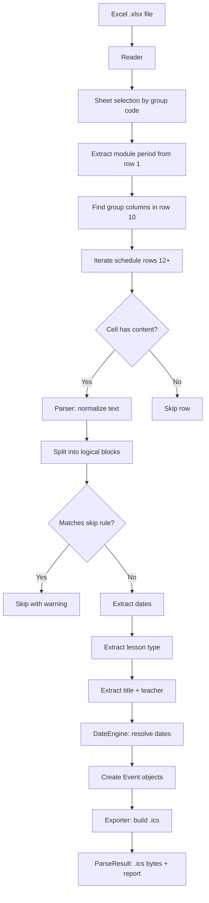

# Architecture Plan: HSE Calendar Parser

## 1. Data Analysis Findings

### 1.1. File Structure (Actual vs TASK.md)

**TASK.md says:** One sheet with blocks separated by `# 1 курс`, `# 2 курс` etc.

**Reality:** Each course has its **own sheet** (tab) in the workbook:
- `1 курс` — Module 2 (Nov-Dec) data for 1st year
- `1 курс.` — Module 3 (Jan-Mar) or Module 4 (Apr-Jun) data for 1st year
- `2 курс` — 2nd year data
- `3 курс` — 3rd year data
- `4 курс` — 4th year data
- `Календарь` — Calendar reference table

**Key insight:** The sheet name determines the course, not a text marker within a sheet. The `1 курс.` (with trailing dot) is the "current module" sheet for 1st year.

### 1.2. Column Layout Variations

The column layout varies by course and file:

| File | Sheet | Groups | Columns |
|------|-------|--------|---------|
| 3 module | `1 курс.` | 25ФИЛ1, 25ФПЛ1, 25ФПЛ2 | E-G, I-K, M-O (3 groups, no 25ФИЛ2) |
| 3 module | `2 курс` | 24ФИЛ1, 24ФПЛ1, 24ФПЛ2 | E-G, I-K, M-O (3 groups, no 24ФИЛ2) |
| 3 module | `3 курс` | 23ФИЛ1, 23ФИЛ2, 23ФПЛ1, 23ФПЛ2 | E-G, I-K, M-O, Q-S (4 groups) |
| 3 module | `4 курс` | 22ФИЛ1, 22ФИЛ2, 22ФПЛ1, 22ФПЛ2 | E-G, I-K, M-O, Q-S (4 groups) |
| 4 module | `1 курс.` | 25ФИЛ1, 25ФПЛ1, 25ФПЛ2 | E-G, I-K, M-O (3 groups) |
| 4 module | `2 курс` | 24ФИЛ1, 24ФПЛ1, 24ФПЛ2 | E-G, I-K, M-O (3 groups) |
| 4 module | `3 курс` | 23ФИЛ1, 23ФИЛ2, 23ФПЛ1, 23ФПЛ2 | E-G, I-K, M-O, Q-S (4 groups) |
| 4 module | `4 курс` | 22ФИЛ1, 22ФИЛ2, 22ФПЛ1, 22ФПЛ2 | E-G, I-K, M-O, Q-S (4 groups) |

**Column pattern:** `B`=Day, `C`=Time, then for each group: `[Group]`, `[Ауд.]`, `[Корпус]` in consecutive columns.

**Edge case:** `2 курс` in 3 module file has `24 ФПЛ1` and `24 ФПЛ2` (with spaces in names).

### 1.3. Row Structure (per sheet)

| Rows | Content |
|------|---------|
| 1 | Title: `БАКАЛАВРИАТ - N курс, M модуль (DD.MM. - DD.MM.)` |
| 2-6 | Building legend (БП, К, Л, Р, С) |
| 7 | `ССЫЛКИ НА ONLINE - ЗАНЯТИЯ` |
| 8 | Empty |
| 9 | Column headers: `День`, `Время`, `ОП "Филология"`, `ОП "Фундаментальная..."` |
| 10 | Group codes: `25ФИЛ1`, `Ауд.`, `Корпус`, ... |
| 11 | Empty |
| 12+ | Schedule data rows |
| Last | `Занятия по дисциплине "Физическая культура"...` |

### 1.4. Cell Content Patterns Observed

From actual data analysis, the following patterns are confirmed:

1. **Period format:** `с 12.01 по 23.03` (with or without dots after day numbers)
2. **Specific dates:** `03.11, 17.11, 01.12, 15.12`
3. **Cancellation:** `12.01 - отмена`, `29.04 - отмена (восстановлено 02.04)`
4. **Recovery:** `25 мая восстановление`, `01.06 восстановление`
5. **Week parity:** `верхняя неделя`, `нижняя неделя`
6. **Multiple disciplines in one cell:** Separated by `____+` (underscore line)
7. **Subgroup markers:** `гр.1`, `гр.2`, `гр 46`
8. **Location overrides:** `13.02 в 201 Сорм`, `14.03 ауд. 308`
9. **Make-up classes:** `13.06 (за 12.06)`, `30.05 (за 3 модуль)`
10. **Online:** `online`, `онлайн`, `олайн`
11. **External schedules:** English, Physical Education, MINOR
12. **Isolated names:** `Королева М.В.` (orphan row)
13. **Multi-line auditorium cells:** Multiple rooms separated by newlines, corresponding to multiple disciplines

### 1.5. Critical Edge Cases

- **Wrong title in 4 module's `4 курс` sheet:** Title says `1 курс` but groups are `22ФИЛ1` etc. (4th year). Must rely on group code, not title.
- **`2 курс` in 3 module file:** Has `24 ФПЛ1` (with space) instead of `24ФПЛ1`.
- **Orphan teacher names:** Row 52 in 3 module `1 курс.` has just `Королева М.В.` with no context.
- **Multi-line auditorium cells:** Room numbers separated by newlines, must be split to match corresponding disciplines.
- **`восстнолвение` typo:** Actual data has this typo for `восстановление`.

---

## 2. Architecture Overview

```
┌──────────────────────────────────────────────────────┐
│                    CLI (click)                        │
│  python -m hse_parser --file ... --group ...          │
└─────────────────────┬────────────────────────────────┘
                      │
┌─────────────────────▼────────────────────────────────┐
│              Controller (orchestrator)                │
│  ParseConfig → run_pipeline() → ParseResult           │
└──┬──────────┬──────────┬──────────┬──────────────────┘
   │          │          │          │
   ▼          ▼          ▼          ▼
┌──────┐ ┌────────┐ ┌──────────┐ ┌────────┐
│Reader│ │ Parser │ │DateEngine│ │Exporter│
│openpy│ │ regex  │ │datetime  │ │icalend │
│xl    │ │ rules  │ │dateutil  │ │ar      │
└──┬───┘ └───┬────┘ └────┬─────┘ └───┬────┘
   │         │           │           │
   └─────────┴───────────┴───────────┘
                     │
              ┌──────▼──────┐
              │   Models    │
              │ (dataclasses)│
              └─────────────┘
```

---

## 3. Module-by-Module Specification

### 3.1. `config.py` — ParseConfig

Pydantic model for all configuration parameters:

```python
class ParseConfig(BaseModel):
    file_path: Path
    group_code: str              # e.g., "25ФПЛ1"
    output_path: Path | None     # default: {group}_module{N}.ics
    subgroup: int | None         # 1 or 2
    academic_year_start: int     # default 2025
    skip_minor: bool = True
    skip_english: bool = True
    skip_pe: bool = True
    verbose: bool = False
```

### 3.2. `models.py` — Internal Data Models

```python
@dataclass
class RawLessonBlock:
    dates: list[date]
    title: str
    lesson_type: str             # лекция, семинар, etc.
    teachers: list[str]
    subgroup: int | None
    is_online: bool
    is_cancelled: bool
    recovery_date: date | None
    week_parity: Literal["upper", "lower", None]
    location_override: dict[date, str]  # date → room override

@dataclass
class Event:
    uid: str
    summary: str                 # [Тип] Название
    start: datetime              # timezone-aware, Europe/Moscow
    end: datetime
    location: str | None
    description: str
    source_text: str
    status: str = "CONFIRMED"

@dataclass
class Warning:
    row: int
    col: str
    text: str                    # truncated to 200 chars
    reason: str                  # UNPARSEABLE_DATES, EXTERNAL_SCHEDULE, etc.

@dataclass
class ParseResult:
    ics_content: bytes
    report: str
    warnings: list[Warning]
    events_count: int
```

### 3.3. `reader.py` — Excel Reader

**Responsibilities:**
1. Open `.xlsx` with `openpyxl` in `read_only=True`
2. Determine which sheet to use based on group code prefix (25→1 курс, 24→2 курс, etc.)
3. For 1st year: prefer `1 курс.` (current module) over `1 курс` (module 2)
4. Extract module period from row 1: `3 модуль (09.01. - 24.03.)`
5. Find group columns in row 10 by matching group code
6. Iterate schedule rows (row 12+), collecting: day, time, subject, auditorium, building
7. Handle merged cells for day column (B column)
8. Stop at empty rows or footer markers

**Key algorithm for sheet selection:**
```python
def find_sheet(wb, group_code: str) -> str:
    prefix = group_code[:2]  # "25" → 1 курс
    course_map = {"25": "1 курс", "24": "2 курс", "23": "3 курс", "22": "4 курс"}
    base = course_map[prefix]
    # Prefer "1 курс." over "1 курс" for 1st year
    if base == "1 курс" and "1 курс." in wb.sheetnames:
        return "1 курс."
    return base
```

### 3.4. `parser/` package — Cell Content Parser

#### 3.4.1. `text_cleaner.py` — Text Normalization

```python
def normalize_text(text: str) -> str:
    # 1. Replace HTML tags: <br> → \n, <br/> → \n
    # 2. Replace &nbsp; → space
    # 3. Normalize line endings: \r\n → \n
    # 4. Strip leading/trailing whitespace per line
    # 5. Normalize online variants → "online"
    # 6. Normalize отмена variants → "отмена"
    # 7. Normalize восстановление variants → "восстановление"
    # 8. Collapse multiple empty lines
```

#### 3.4.2. `date_parser.py` — Date Extraction

Extract date patterns from text:

| Pattern | Regex | Action |
|---------|-------|--------|
| Specific dates | `\d{1,2}\.\d{2}` | Collect as list |
| Period | `с\s+\d{1,2}\.\d{2}\s*по\s+\d{1,2}\.\d{2}` | Generate all dates in range matching day-of-week |
| Cancellation | `\d{1,2}\.\d{2}\s*-\s*отмена` | Mark date as cancelled |
| Recovery | `\d{1,2}\.\d{2}\s*-\s*отмена\s*\(восстановлено\s+\d{1,2}\.\d{2}\)` | Cancel first date, add recovery |
| Recovery (text) | `\d{1,2}\s+мая\s+восстановление` | Add date |
| Week parity | `верхняя\s+неделя` / `нижняя\s+неделя` | Set parity flag |
| Make-up | `\d{1,2}\.\d{2}\s*\(за\s+\d{1,2}\.\d{2}\)` | Create event on first date |

#### 3.4.3. `rules.py` — Skip Rules

```python
SKIP_PATTERNS = [
    r"Занятия проводятся по расписанию дисциплины",
    r"Английский язык",
    r"Физическая культура",
    r"дисциплинам дополнительного профиля MINOR",
    r"ССЫЛКИ НА ONLINE",
]
```

#### 3.4.4. `cell_parser.py` — Main Cell Parser

**Pipeline:**
1. Normalize text via `text_cleaner`
2. Split into logical blocks by `____+` (≥10 underscores) or `\n\n`
3. For each block:
   a. Check skip rules → skip with warning
   b. Extract dates via `date_parser`
   c. Extract lesson type: `лекция`, `семинар`, `практикум`, `НИС`, `МКД`, `МДК`, `консультация`
   d. Extract discipline title (first meaningful line after dates/type)
   e. Extract teacher(s): `Фамилия И.О.` pattern
   f. Check subgroup markers: `гр.X`
   g. Return `RawLessonBlock`

### 3.5. `date_engine.py` — Date Generation

**Pipeline:**
1. If specific dates present → use those (filter out cancelled)
2. If period present → generate all dates in range matching day-of-week
3. Apply week parity filter (upper/lower)
4. Add recovery dates
5. Apply make-up date logic
6. Resolve year: use `academic_year_start` + module rules

**Year resolution:**
```python
def resolve_year(module: int, academic_year_start: int) -> int:
    if module in (3, 4):
        return academic_year_start + 1
    else:  # module 1, 2
        return academic_year_start
```

### 3.6. `exporter.py` — ICS Export

**Pipeline:**
1. Create `icalendar.Calendar` with headers
2. For each `Event`:
   - Generate UID: `hse-{group}-{YYYY-MM-DD}-{HHMM}-{hash}`
   - Set DTSTART/DTEND with timezone Europe/Moscow
   - Set SUMMARY, LOCATION, DESCRIPTION, STATUS
3. Serialize to bytes

### 3.7. `controller.py` — Orchestrator

```python
def run_pipeline(config: ParseConfig) -> ParseResult:
    # 1. Reader: read Excel, extract rows for group
    # 2. For each row with content:
    #    a. Parser: parse cell text → list[RawLessonBlock]
    #    b. DateEngine: generate concrete dates
    #    c. Create Event objects
    # 3. Exporter: convert events to .ics bytes
    # 4. Build report
    # 5. Return ParseResult
```

### 3.8. `cli.py` — CLI Interface

```python
@click.command()
@click.option("--file", "-f", required=True, type=click.Path(exists=True))
@click.option("--group", "-g", required=True)
@click.option("--output", "-o", type=click.Path())
@click.option("--subgroup", type=int)
@click.option("--academic-year-start", default=2025)
@click.option("--skip-minor", default=True)
@click.option("--skip-english", default=True)
@click.option("--skip-pe", default=True)
@click.option("--verbose", "-v", is_flag=True)
def main(...):
    config = ParseConfig(...)
    result = run_pipeline(config)
    # Print report, save .ics, handle warnings
```

### 3.9. `utils.py` — Helpers

- `normalize_group_code(code: str) → str` — strip spaces, uppercase
- `generate_uid(group, date, time, title, teacher) → str` — hash-based UID
- `parse_time_range(range_str) → tuple[time, time]` — "08:00-09:20" → (time, time)
- `russian_month_to_number(name) → int` — "января" → 1

---

## 4. Data Flow Diagram



---

## 5. Implementation Order

The implementation should proceed in this order, with each step building on the previous:

### Step 1: Project Scaffolding
- Create directory structure as specified in TASK.md §11
- Create `pyproject.toml` / `setup.py` for the `hse_parser` package
- Set up virtual environment with dependencies: `openpyxl`, `icalendar`, `click`, `pydantic`, `python-dateutil`

### Step 2: Models (`models.py`)
- Implement `RawLessonBlock`, `Event`, `Warning`, `ParseResult`, `ParseConfig` dataclasses
- These are the foundation all other modules depend on

### Step 3: Utilities (`utils.py`)
- `normalize_group_code()`, `generate_uid()`, `parse_time_range()`, `russian_month_to_number()`
- Text normalization helpers

### Step 4: Reader (`reader.py`)
- Sheet selection logic
- Module period extraction
- Group column detection
- Row iteration with day inheritance
- This is the most critical module for getting data out of Excel

### Step 5: Parser Package
- **5a:** `text_cleaner.py` — text normalization
- **5b:** `date_parser.py` — date pattern extraction
- **5c:** `rules.py` — skip rules
- **5d:** `cell_parser.py` — main parser orchestrating the above

### Step 6: Date Engine (`date_engine.py`)
- Date generation from periods
- Week parity filtering
- Recovery/make-up date handling
- Year resolution

### Step 7: Exporter (`exporter.py`)
- ICS calendar creation
- Event serialization
- Timezone handling

### Step 8: Controller (`controller.py`)
- Pipeline orchestration
- Error handling
- Report generation

### Step 9: CLI (`cli.py`)
- Click command definition
- Argument parsing
- Console output

### Step 10: Tests
- Unit tests for each module
- Integration tests with actual Excel files
- Edge case coverage

---

## 6. Key Design Decisions

### 6.1. Sheet Selection Strategy
**Decision:** Use group code prefix to determine course, then select sheet by course name. For 1st year, prefer `1 курс.` (current module) over `1 курс` (module 2).

**Rationale:** The TASK.md describes blocks within a single sheet, but actual files have separate sheets per course. The sheet name is the reliable indicator.

### 6.2. Column Detection
**Decision:** Search row 10 for exact group code match (case-insensitive, space-normalized). Once found, the next 2 columns are `Ауд.` and `Корпус`.

**Rationale:** Column layout varies by course. Row 10 always contains group codes in the pattern `[Group][Ауд.][Корпус]`.

### 6.3. Cell Splitting Strategy
**Decision:** Split cells by `____+` (≥10 underscores/hyphens) first, then by `\n\n`. Each block is a separate lesson.

**Rationale:** Multiple disciplines in one cell are separated by underscore lines. Within a block, newlines separate different fields.

### 6.4. Date Year Resolution
**Decision:** Use `academic_year_start` + module rules. Module 3 (Jan-Mar) and 4 (Apr-Jun) → `year + 1`. Module 1 (Sep-Dec) and 2 (Nov-Dec) → `year`.

**Rationale:** Academic year 2025-2026 means Sep 2025 - Jun 2026. Module 3 starts in January 2026.

### 6.5. Auditorium Handling
**Decision:** Base values from `Ауд.` and `Корпус` columns. If cell text contains location overrides (e.g., `14.03 ауд. 308`), apply per-date override. Multi-line auditorium cells are split to match corresponding discipline blocks.

**Rationale:** Some cells have specific room changes for particular dates embedded in the text.

### 6.6. Error Handling Philosophy
**Decision:** Never crash on unparseable cells. Log a warning with reason code and continue. Exit code 0 even with warnings, but print warning to stderr.

**Rationale:** The TASK.md explicitly states "Не пытайся угадать всё. Если ячейка не поддаётся парсингу — пропусти с warning."

---

## 7. File Structure

```
hse_parser/
├── __init__.py
├── cli.py                    # Click CLI interface
├── config.py                 # ParseConfig Pydantic model
├── controller.py             # Pipeline orchestrator
├── reader.py                 # Excel file reader
├── parser/
│   ├── __init__.py
│   ├── cell_parser.py        # Main cell parser
│   ├── date_parser.py        # Date pattern extraction
│   ├── text_cleaner.py       # Text normalization
│   └── rules.py              # Skip rules
├── date_engine.py            # Date generation engine
├── models.py                 # Data models (dataclasses)
├── exporter.py               # ICS export
└── utils.py                  # Helper functions
tests/
├── __init__.py
├── fixtures/
│   ├── 3_module.xlsx         # Symlink or copy of actual file
│   └── 4_module.xlsx         # Symlink or copy of actual file
├── test_reader.py
├── test_parser.py
├── test_date_engine.py
└── test_e2e.py
```

---

## 8. Dependencies

```
openpyxl>=3.1       # Excel reading
icalendar>=5.0      # ICS generation
click>=8.0          # CLI interface
pydantic>=2.0       # Configuration validation
python-dateutil>=2.8 # Date utilities
pytest>=7.0         # Testing
```

---

## 9. Test Scenarios

Based on TASK.md §9.1 and actual data analysis:

| # | Scenario | Test Data | Expected |
|---|----------|-----------|----------|
| 1 | Basic period | `с 12.01 по 23.03` on Monday | 11 events (Mondays in range) |
| 2 | Specific dates | `03.11, 17.11, 01.12, 15.12` | 4 events |
| 3 | Cancellation | `12.01 - отмена` in period | First Monday excluded |
| 4 | Recovery | `отмена (восстановлено 02.04)` | Event on 02.04 |
| 5 | Week parity | `верхняя неделя` | Only odd week numbers |
| 6 | Subgroup | `--subgroup 1` with `гр.1` and `гр.2` | Only gr.1 events |
| 7 | Online | `online` in Корпус column | `LOCATION: Online` |
| 8 | English skip | English language cell | Warning, no event |
| 9 | Multiple disciplines | Cell with `____` separator | Two separate events |
| 10 | Room override | `14.03 ауд. 308` in text | Override for that date |
| 11 | Make-up class | `13.06 (за 12.06)` | Event on 13.06 |
| 12 | Wrong sheet title | 4 module `4 курс` says "1 курс" | Correctly uses group code |
| 13 | Orphan teacher | Isolated `Королева М.В.` | Warning, no event |
| 14 | Typo in recovery | `восстнолвение` | Normalized to `восстановление` |