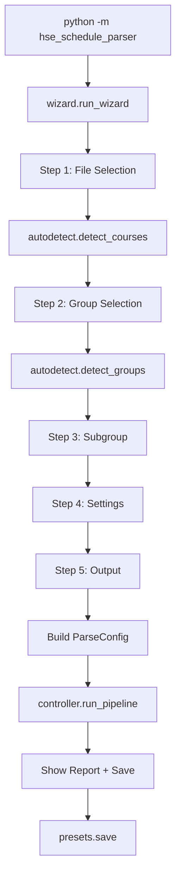

# Architecture Plan: HSE Schedule Parser v2.1 — TUI Wizard

## 1. Key Architectural Decision: Package Structure

**Decision:** Keep `hse_parser/` as the core parsing engine (unchanged). Create a **new package** `hse_schedule_parser/` that wraps the core with TUI interface.

**Rationale:**
- `hse_parser/` is the stable, tested parsing core — don't touch it
- `hse_schedule_parser/` is the user-facing application with TUI, wizard, autodetection
- Clean separation: core vs UI. In future, could swap TUI for Telegram bot
- The TZ says `python -m hse_schedule_parser` as entry point

**Structure:**
```
hse_schedule_parser/          # NEW — TUI application package
├── __init__.py
├── __main__.py               # Entry: python -m hse_schedule_parser
├── tui.py                    # Rich UI components (panels, progress, tables)
├── wizard.py                 # 5-step wizard logic + state machine
├── autodetect.py             # Smart detection from Excel file
└── presets.py                # Save/load user preferences (JSON)

hse_parser/                   # EXISTING — core parsing engine (unchanged)
├── __init__.py
├── cli.py                    # Still works for advanced users
├── config.py
├── controller.py
├── reader.py
├── parser/
├── date_engine.py
├── models.py
├── exporter.py
└── utils.py
```

## 2. Module Responsibilities

### 2.1. `hse_schedule_parser/__main__.py`
- Single entry point: `python -m hse_schedule_parser`
- Imports and runs `wizard.run_wizard()`
- No CLI args — pure interactive mode

### 2.2. `hse_schedule_parser/wizard.py` — Wizard State Machine
- **State:** `WizardState` dataclass holding all user choices
- **5 steps:**
  1. `step_file()` — file selection (drag path, manual path, search Downloads)
  2. `step_group()` — detect groups from file, let user pick
  3. `step_subgroup()` — optional subgroup filter
  4. `step_settings()` — toggle skip flags, reminders
  5. `step_output()` — save location or preview only
- **Flow:** Each step returns `WizardState` or `None` (go back)
- **Validation:** Each step validates before proceeding

### 2.3. `hse_schedule_parser/tui.py` — Rich UI Components
- `show_banner()` — app header panel
- `show_progress()` — progress bar during parsing
- `show_report()` — formatted report with warnings
- `show_success()` — completion message with import instructions
- `ask_file()` — file selection prompt
- `ask_choice()` — numbered list selection
- `ask_toggles()` — toggle settings with checkboxes
- `ask_path()` — path input with validation

### 2.4. `hse_schedule_parser/autodetect.py` — Smart Detection
- `detect_courses(file_path)` — open workbook, return list of available course numbers
- `detect_groups(file_path, course)` — return list of group codes for a course
- `detect_module(file_path, course)` — return module number and period
- `detect_subgroups(file_path, group_code)` — detect if group has subgroup split
- `suggest_year()` — smart default for academic year (current year or year-1 based on date)

### 2.5. `hse_schedule_parser/presets.py` — User Preferences
- Save/load `~/.config/hse-schedule-parser/presets.json`
- Store: last file path, last group, skip flags, reminders preference
- Auto-load on startup, auto-save on completion

## 3. Data Flow



## 4. Dependencies to Add

```toml
dependencies = [
    ...existing...
    "rich>=13.0",        # Beautiful terminal UI
    "questionary>=2.0",  # Interactive prompts
]
```

## 5. Implementation Order

1. Create `hse_schedule_parser/` package structure
2. Implement `autodetect.py` — needs to work with `openpyxl` to scan files
3. Implement `tui.py` — all Rich UI components
4. Implement `wizard.py` — 5-step wizard
5. Implement `presets.py` — save/load preferences
6. Implement `__main__.py` — entry point
7. Update `pyproject.toml` — new entry point + dependencies
8. Create `docs/HOWTOUSE.md` and `docs/FAQ.md`
9. Update `README.md`
10. GitHub: issue templates + Actions
11. Commit and push

## 6. Key Design Decisions

### 6.1. No `click` in TUI mode
The TUI is pure `rich` + `questionary`. The existing `click` CLI remains for advanced users via `python -m hse_parser.cli`.

### 6.2. Autodetection reads file twice
First in `autodetect.py` to scan groups/courses, then in `reader.py` for actual parsing. Acceptable — files are small (<1MB).

### 6.3. Presets stored in XDG config
`~/.config/hse-schedule-parser/presets.json` — follows Linux conventions. On Windows: `%APPDATA%/hse-schedule-parser/presets.json`.

### 6.4. Error handling
- File not found → friendly message, offer to retry
- No groups found → suggest checking file
- Parse errors → show in report, don't crash
- KeyboardInterrupt → graceful exit with "До встречи!"

## 7. Files to Create

| File | Purpose |
|------|---------|
| `hse_schedule_parser/__init__.py` | Empty |
| `hse_schedule_parser/__main__.py` | Entry point |
| `hse_schedule_parser/tui.py` | Rich UI components |
| `hse_schedule_parser/wizard.py` | Wizard state machine |
| `hse_schedule_parser/autodetect.py` | Smart detection |
| `hse_schedule_parser/presets.py` | User preferences |
| `docs/HOWTOUSE.md` | User guide |
| `docs/FAQ.md` | FAQ |
| `.github/ISSUE_TEMPLATE/bug_report.md` | Bug report template |
| `.github/ISSUE_TEMPLATE/feature_request.md` | Feature request template |
| `.github/workflows/release.yml` | Build & release |

## 8. Files to Modify

| File | Changes |
|------|---------|
| `pyproject.toml` | Add `rich`, `questionary` deps; add `hse-schedule-parser` entry point; add `hse_schedule_parser*` to packages |
| `README.md` | Add TUI mode section, update installation |